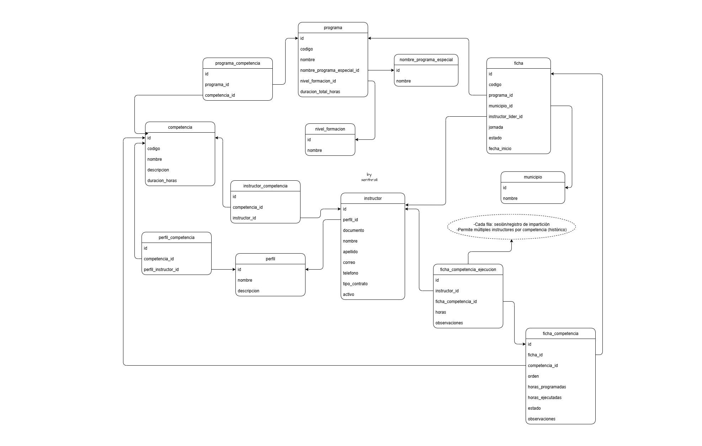

# CronoSENA

Sistema inteligente de planificación académica para el SENA.

---

## 📖 Descripción

CronoSENA es un sistema diseñado para optimizar la **planificación académica** en el SENA, gestionando programas, competencias, instructores y fichas de formación de manera eficiente.

---

## 📊 Modelo de Base de Datos

El siguiente diagrama muestra el modelo entidad-relación (MER) que soporta el sistema:

---

## ⚠️ Aclaración

Este proyecto **no es un producto oficial del SENA**.  
Fue desarrollado como **proyecto de formación** en el programa de **Análisis y Desarrollo de Software (ADSO)**, con el propósito de solventar una necesidad evidenciada en el centro de formación donde realicé mis estudios.  